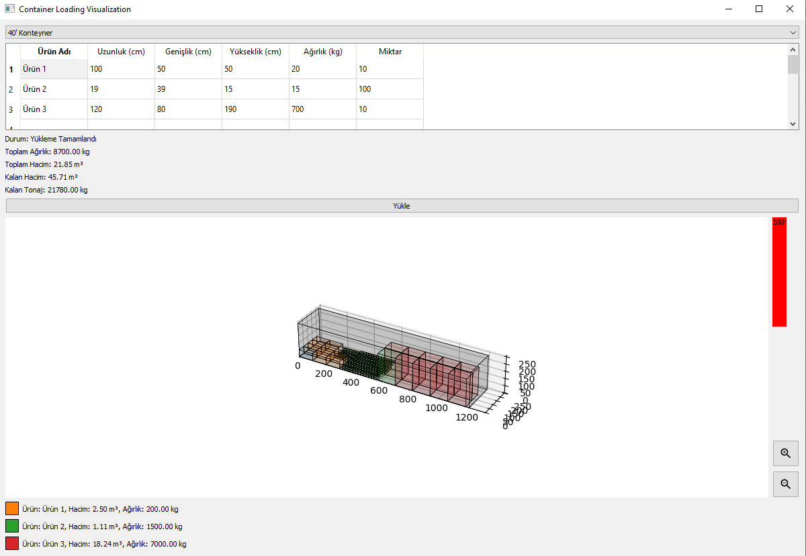

# Container Loading Visualization

This project aims to provide a visualization tool for loading containers with different products. It helps in calculating the total weight, volume, and remaining capacity of a container based on the dimensions and quantities of various products. The project uses Python for data processing and visualization.

## Features

- **Data Input and Processing:**
  - Input product details including name, dimensions (length, width, height), weight, and quantity.
  - Calculate the volume and total weight for each product.
  - Summarize the total volume and weight of all products.

- **Capacity Calculation:**
  - Calculate the remaining volume and weight capacity of the container.
  - Display the status of loading completion.

- **Visualization:**
  - 3D visualization of the container and the arrangement of products inside it.
  - Visual representation of product dimensions and positions within the container.
  - Display the container's fill percentage.

## Dependencies

- **pandas:** For data manipulation and calculation.
- **matplotlib:** For 3D visualization of the container and products.
- **pyqt5:** For graphical user interface.

## Installation

The project uses Poetry for dependency management. Ensure Poetry is installed on your system, then follow these steps to set up the project:

1. **Install Dependencies:**

    ```sh
    poetry install
    poetry add pyqt5
    ```

2. **Run the Program:**

    ```sh
    poetry run python load_2D/main.py
    ```

## Usage

1. **Prepare Your Data:**
   - Create a CSV file or directly edit the script to input your product data. The data should include columns for product name, dimensions (length, width, height), weight, and quantity.
   - Example data format:
     | Ürün Adı | Uzunluk (cm) | Genişlik (cm) | Yükseklik (cm) | Ağırlık (kg) | Miktar |
     |----------|---------------|---------------|----------------|--------------|--------|
     | Ürün 1   | 100           | 50            | 50             | 20           | 10     |
     | Ürün 2   | 19            | 39            | 15             | 15           | 100    |
     | Ürün 3   | 120           | 80            | 190            | 700          | 10     |

2. **Run the Script:**
   - After preparing your data, run the script using the following command:
     ```sh
     poetry run python Load_2D/main.py
     ```

3. **View the Output:**
   - The program will calculate the total weight, volume, and remaining capacity of the container.
   - A 3D visualization will be generated, showing the arrangement of products inside the container.
   - The summary of total weight, volume, and remaining capacity will be printed in the console.

## Example Output

Here is an example of what the output looks like when the program runs successfully:



This project provides a comprehensive solution for visualizing and managing the loading of containers, ensuring optimal use of space and weight capacity.
